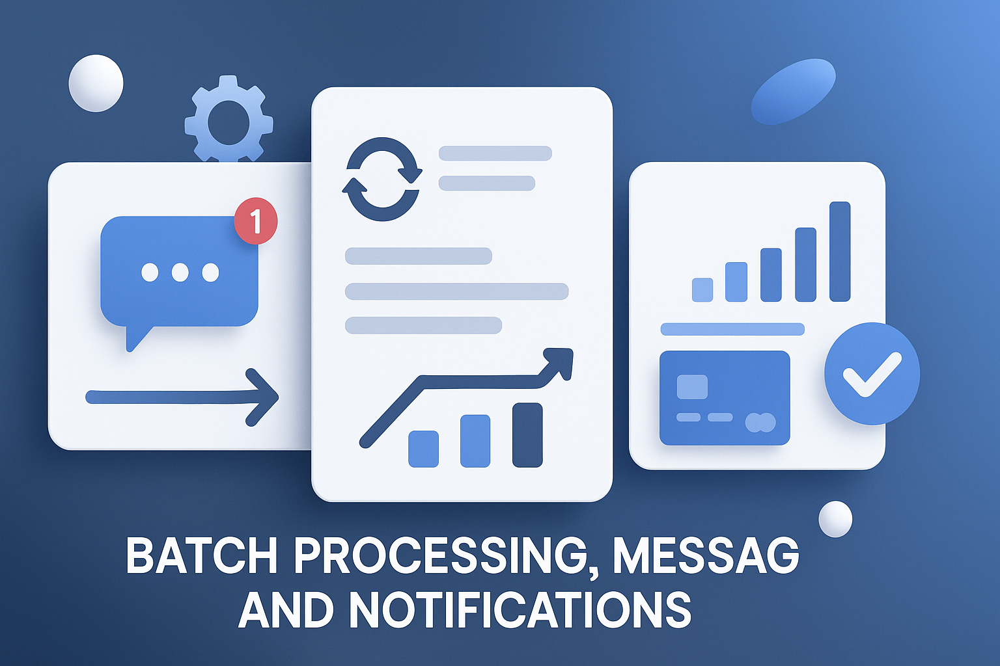

 

     
    

##    Processing, Messaging and Notification

 

Central repository for backend projects focused on batch processing, messaging systems integration, and notification delivery services.

 

 * Languages : Java, others.
 * Frameworks : Spring Framework, Prometheus, others.
 * Spring modules : Spring Boot, Spring Batch, Spring Cloud, Spring Data JPA, others.
 * ORM : JPA-Hibernate, others.
 * Databases : MySQL, PostgreSQL, others.
 * Libraries : Resilience4J, Lombok, dotenv, cors, others.
 * Tools : Grafana, STS, VSC, Postman, Maven, swagger, Git, Mailpit, others.
 * Testing : Junit, others.

  
 
  

<!------Start Index----->

## Index 📜

 
 See 

  

#### 🗂️ Projects

* [Credit Risk Analysis Batch ](#credit-risk-analysis-batch--)

  

    
    
    
    
    
     
        
  

* [Spring Batch Processing Payments ](#spring-batch-processing-payments--)

  

    
    
    
    
    
     
        
  

* [Card Payment Simulator ](#card-payment-simulator--)

  

    
    
    
    
    
    
        
  
  

* [User Management Email API ](#user-management-email-api--)

  

    
    
    
    
    
    
    
    
    
    
        
  

* [Emails Notifications MailHog ](#emails-notifications-mailhog--)

  

    
    
    
    
    
    
    
    
        
  

 

<!------Stop Index----->
  
 
  

    
 ## 🗂️ Projects

 

 <!------START Credit_Risk_Analysis_Batch------>

  
### Credit Risk Analysis Batch  [🔝](#index-)

  

  

    
    
    
    
    
     
        
  

 

 ### Details

  
  

   
<!------END Credit_Risk_Analysis_Batch------->

 
 
  
 
  
 

 <!------START Spring_Batch_Processing_Payments------>

  
### Spring Batch Processing Payments  [🔝](#index-)

  

  

    
    
    
    
    
    
     
        
  

 

 ### Details

  
  

   
<!------END Spring_Batch_Processing_Payments------->

 
 
  
 
  
 

 <!------START Card_Payment_Simulator------>

  
### Card_Payment_Simulator [🔝](#index-)

  

  

    
    
    
    
    
    
       
  

 

 ### Details

  
  

   
<!------END Card_Payment_Simulator------->

 
 
  
 
  
 

<!------START email-api-service-MailPit------>

  
### User Management Email API  [🔝](#index-)

  

  

    
    
    
    
    
    
    
    
    
    
        
  

 

 ### Details

  
  

   
<!------END email-api-service-MailPit------>

 
 
  
 
  
 

<!------START emails-notifications-MailHog------>

  
### Emails Notifications MailHog  [🔝](#index-)

  

 

      
      
      
      
      
      
      
      
      
    

 

 ### Details

  
  

   
<!------END emails-notifications-MailHog------>

 
 
 
 
 
 

