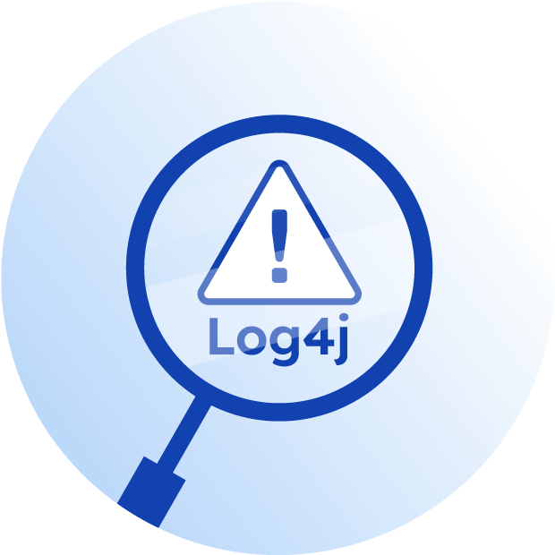

 

     
    

##    Processing, Messaging and Notification

 

Central repository for backend projects focused on batch processing, messaging systems integration, and notification delivery services.

 

 * Languages : Java, others.
 * Frameworks : Spring Framework, Prometheus, others.
 * Spring modules : Spring Boot, Spring Batch, Spring Cloud, Spring Data JPA, others.
 * ORM : JPA-Hibernate, others.
 * Databases : MySQL, PostgreSQL, others.
 * Libraries : Resilience4J, Lombok, dotenv, cors, others.
 * Tools : Grafana, STS, VSC, Postman, Maven, swagger, Git, others.
 * Testing : Junit, others.

  
 
  

<!------Start Index----->

## Index 📜

 
 See 

  

#### 🗂️ Projects 
* [Emails Notifications MailHog](#emails-notifications-mailhog-)

  

      
      
      
      
      
      
      
      
      
    
    

 

<!------Stop Index----->
  
  
 
  
 

<!------START emails-notifications-MailHog------>

  
### Emails Notifications MailHog. [🔝](#index-)

  

 

      
      
      
      
      
      
      
      
      
    

 

 ### Details

  
  

   

<!------END emails-notifications-MailHog------>

 
 
 
 
 
 

