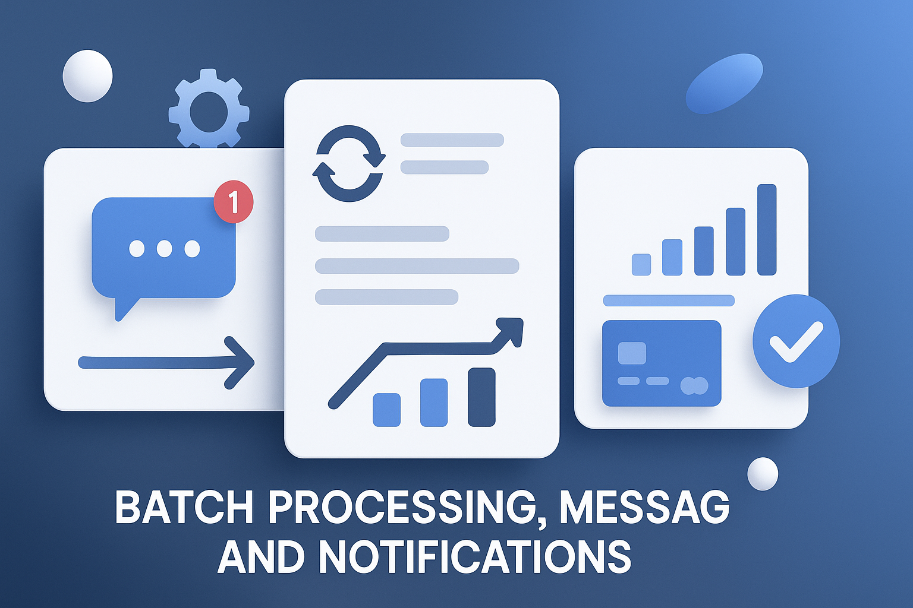

 

     
    

##    Procesamiento, Mensajería y Notificaciones

 

Repositorio central para proyectos backend enfocados en procesamiento por lotes, integración de sistemas de mensajería y servicios de entrega de notificaciones.

 

 * Lenguajes : Java, otros.
 * Frameworks : Spring Framework, Prometheus, otros.
 * Módulos Spring : Spring Boot, Spring Batch, Spring Cloud, Spring Data JPA, otros.
 * ORM : JPA-Hibernate, otros.
 * Bases de datos : MySQL, PostgreSQL, otros.
 * Librerías : Resilience4J, Lombok, dotenv, cors, otros.
 * Herramientas : Grafana, STS, VSC, Postman, Maven, swagger, Git, Mailpit, otros.
 * Testing : Junit, otros.

  
 
  

<!------Start Index----->

## Índice 📜

 
 Ver 

  

#### 🗂️ Proyectos

* [Análisis de Riesgo Crediticio por Lotes ](#análisis-de-riesgo-crediticio-por-lotes--)

  

    
    
    
    
    
     
        
  

* [Procesamiento de Pagos con Spring Batch ](#procesamiento-de-pagos-con-spring-batch--)

  

    
    
    
    
    
     
        
  

* [Simulador de Pagos con Tarjeta ](#simulador-de-pagos-con-tarjeta-)

  

    
    
    
    
    
    
        
  
  
   

* [API de Gestión de Usuarios por Email ](#api-de-gestión-de-usuarios-por-email--)

  

    
    
    
    
    
    
    
    
    
    
        
  

* [Notificaciones de Emails con MailHog ](#notificaciones-de-emails-con-mailhog--)

  

    
    
    
    
    
    
    
    
        
  

 

<!------Stop Index----->
  
 
  

    
 ## 🗂️ Proyectos

 

 <!------START Credit_Risk_Analysis_Batch------>

  
### Análisis de Riesgo Crediticio por Lotes  [🔝](#índice-)

  

  

    
    
    
    
    
     
        
  

 

 ### Detalles

  
  

   
<!------END Credit_Risk_Analysis_Batch------->

 
 
  
 
  
 

 <!------START Spring_Batch_Processing_Payments------>

  
### Procesamiento de Pagos con Spring Batch  [🔝](#índice-)

  

  

    
    
    
    
    
    
     
        
  

 

 ### Detalles

  
  

   
<!------END Spring_Batch_Processing_Payments------->

 
 
  
 
  
 

<!------START Card_Payment_Simulator------>

  
### Simulador de Pagos con Tarjeta [🔝](#índice-)

  

  

    
    
    
    
    
    
       
  

 

 ### Detalles

  
  

   
<!------END Card_Payment_Simulator------->

 
 
  
 
  
 

<!------START email-api-service-MailPit------>

  
### API de Gestión de Usuarios por Email  [🔝](#índice-)

  

  

    
    
    
    
    
    
    
    
    
    
        
  

 

 ### Detalles

  
  

   
<!------END email-api-service-MailPit------>

 
 
  
 
  
 

<!------START emails-notifications-MailHog------>

  
### Notificaciones de Emails con MailHog  [🔝](#índice-)

  

 

      
      
      
      
      
      
      
      
      
    

 

 ### Detalles

  
  

   
<!------END emails-notifications-MailHog------>

 
 
 
 
 
 

